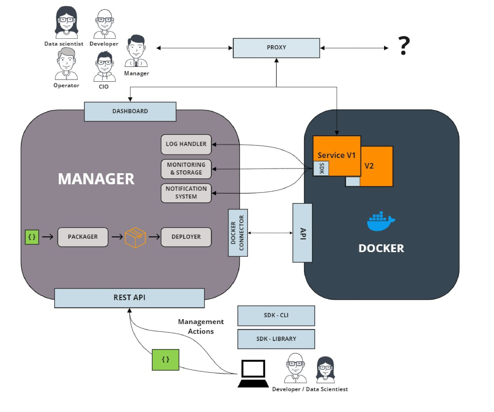

# Daeploy

## Branching strategy

This repo is maintained using the following branching strategy:

- **master**, holds "releasable code"
- **develop**, default branch

The workflow is:

- Releases are handled as tags off of master.
- Urgent bug-fixes are branched of master and PR:ed to master
- New features, enhancements and non-urgent bug-fixes are branched off of develop and PR:ed to develop
- Any urgent bug-fixes merged directly to master should also be merged/rebased to develop (i.e. develop should never be behind master)

## Development setup

Prerequisites:

- WSL2 with ubuntu distribution, see [here](https://docs.microsoft.com/en-us/windows/wsl/install-win10)
- Docker installation setup with WSL2, see [here](https://docs.docker.com/docker-for-windows/wsl/)
- Python >= 3.6
- Source to image. Check the installation section in [here](https://github.com/openshift/source-to-image)
- Traefik reverse proxy (latest version is 2.3.1 (2020-10-14))

```bash
  mkdir tmp
  wget -c https://github.com/traefik/traefik/releases/download/v2.3.1/traefik_v2.3.1_linux_amd64.tar.gz -P tmp/
  tar -zxvf tmp/traefik_v2.3.1_linux_amd64.tar.gz -C tmp/
  sudo cp tmp/traefik /usr/local/bin/
  rm -r tmp/
```

- (Optional but handy since it includes debug setups) VS code

All of the following commands should be executed in a WSL2 (ubuntu) environment.

In general it is beneficial to keep files in the linux filesystem (NOT the ```/mnt/c/...```) for better speed and, if necessary, access it through ```\\wsl$``` in the Windows filesystem.

Start by cloning the repo in your wsl.

Setup of virtual environment:

```bash
python3 -m venv venv
source venv/bin/activate
pip install -r requirements_manager.txt
pip install -r requirements_sdk.txt
pip install -r requirements_dev.txt
```

To start manager in auto-reloading development mode:

```bash
uvicorn manager.app:app --reload
```

To run tests:

```bash
python -m pytest tests
```

### Debug

To debug in VS code:

- Make sure you have opened vs code so that the repo root is the workspace, for example according to:

```bash
(venv) freol@LAPTOP-P6BMIDRA:~/dev/daeploy$ code .
```

- Put a breakpoint somewhere in the code and start the app.py file in VS code using the F5 button.

Debugging the SDK and/or the communction between manager/proxy/services:

- Deploy a service, preferably one created using the SDK
- Enter the container via bash by:

```bash
docker exec -it {docker_id_for_service} bash
```

- While inside the container you can for instance use `curl` or `python` for debuging.

### Docker build

The manager can be be built as a docker container for development purposes. Commands to be executed from root-folder of repo.

```console
docker build -t daeploy/manager:latest .
```

```console
docker run -v /var/run/docker.sock:/var/run/docker.sock -p 80:80 -p 443:443 -e DAEPLOY_AUTH_ENABLED=True -d daeploy/manager:latest
```

## Accessibility

The application will be available according to the following:

- Docker container listens on ports 80 (http) and 433 (https)
- Proxy listens on ports 5080 (http) and 5443 (https)
- Manager is available at ```/``` (or locally on port 8000)
- Any started services are available at ```/services/{service_name}/``` (or locally on ports 8001 and upwards)
- Proxy built-in dashboard is available at ```/proxy/dashboard/```

## Docs

To build the docs as html pages:

### Without multiversion support

```bash
cd docs
make clean html
```

### With multiversion support

```bash
cd docs
sphinx-multiversion source/ build/html/
```

The index HTML page can then be found at `docs/build/html/index.html`

## Scope

Can be found here: [Scope Statement](https://vikinganalytics.sharepoint.com/sites/InfofromCEO/_layouts/15/Doc.aspx?OR=teams&action=edit&sourcedoc={16A4E267-B68C-4EEE-BB65-1458056E1C93})

## Architecture Overview


