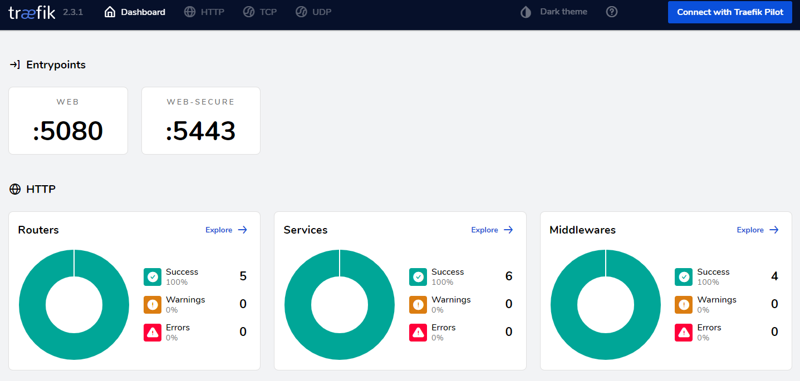

.. _proxy-dashboard-reference:

Proxy Dashboard
===============

All external communication to the Daeploy Manager happens through a proxy.
The proxy uses the `traefik <https://doc.traefik.io/traefik/>`_ edge router,
that comes with a dashboard, where you can inspect how the data is being routed.
It is mostly useful for debugging, to see if the data is actually being sent where
it should be, or if it is a problem with the service code.

The proxy dashboard is available at `http://<your-host>/proxy/dashboard/`

(click image to enlarge)

