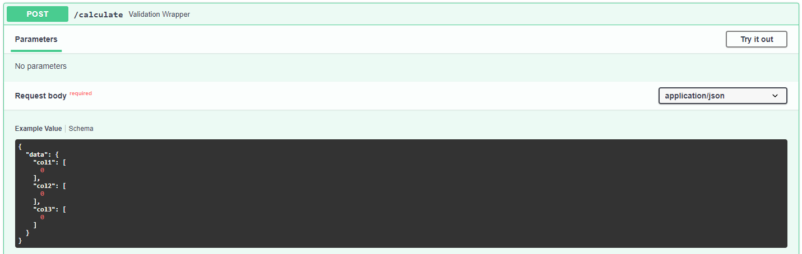
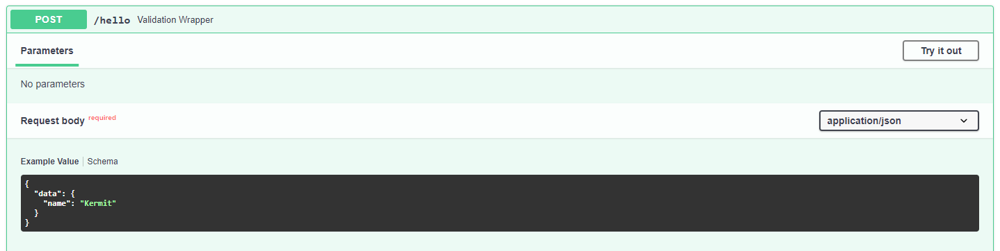

.. _sdk-typing-reference:

Typing in the SDK
=================

The :ref:`sdk-reference` supports type hints to add validation to the resulting API
as well as well-defined json schemas for the automated documentation. In this
tutorial we will see how we can make use of this to make the API and interactive
docs easier to use.

.. note:: Daeploy entrypoints communicate with json schemas and do therefore
    only support json-compatible input and output, such as numericals, strings,
    lists and dictionaries.

Why Type Hints?
---------------

It is not required to use type hints for your entrypoint functions. But if they are
used they will give validation to the API, which can otherwise require a fair bit
of code. Let's look at the :py:func:`hello` entrypoint that we've seen
a few times already, but without type hints:

.. testcode::

    from daeploy import service

    @service.entrypoint
    def hello(name):
        return f"Hello {name}"

    if __name__ == "__main__":
        service.run()

Without the type hint, any data type is allowed into the entrypoint. Let's
say that an error caused a list of names to be sent to name instead of a single name
then this entrypoint would respond with ``"Hello ['Lars', 'Claus', 'Bob']"`` and a
status code of 200. We also won't get any schema definitions in the API documentation.
Let's define the same entrypoint again but with type hints this time:

.. testcode::

    from daeploy import service

    @service.entrypoint
    def hello(name: str) -> str:
        return f"Hello {name}"

    if __name__ == "__main__":
        service.run()

With the same input ``{"name": ['Lars', 'Claus', 'Bob']}`` we would get a 422 error
and the response::
   
    {
    "detail": [
      {
        "loc": [
          "body",
          "name"
        ],
        "msg": "str type expected",
        "type": "type_error.str"
        }
      ]
    }

Which tells us that the name argument expected a string, but got something else.

.. note:: The validation uses `pydantic <https://pydantic-docs.helpmanual.io/>`_
    behind the scenes which will try to coerce the input to the correct type,
    so if we were to call :py:func:`hello` with the input ``{"name": 1}`` it will
    convert ``1`` to string and respond with ``Hello 1``. If this behaviour is not
    not desirable, take a look at pydantic's
    `strict types <https://pydantic-docs.helpmanual.io/usage/types/#strict-types>`_.

Creating an Input Model
-----------------------

In our examples so far we have only seen standard python types as type hints:

.. testcode::
    
    from daeploy import service

    @service.entrypoint
    def example(data: dict) -> int:
        pass

This makes sure that only dictionaries can be used as input for :py:func:`example`.
But a dictionary can contain many types of data, and usually only one (or a few)
ways are expected. To simplify the life of the user, we can define something called
a data model, that we create by extending the :py:class:`BaseModel` class from
`pydantic <https://pydantic-docs.helpmanual.io/>`_:

.. testcode::
    from typing import Optional
    from pydantic import BaseModel

    class Item(BaseModel):
        name: str
        description: Optional[str] = None
        price: float
        tax: Optional[float] = None

The :py:class:`BaseModel`
describes a JSON ``object`` (or python ``dict``) like::

    {
        "name": "Foo",
        "description": "An optional description",
        "price": 45.2,
        "tax": 3.5
    }

The :py:class:`BaseModel` helps the API to know what format the input json should
conform to. If the request body of your API call does not match the model it will
send a 422 HTTP-error with an error description.

Let's create a new service that will convert its input into a dataframe and respond
with the sum of its rows. For this we must be certain that the columns only contains
floats:

>>> daeploy init # doctest: +SKIP
project_name [my_project]: row_sum_service

Then in `service.py` write the following code:

.. literalinclude:: ../../../../examples/typing/row_sum_service/service.py

And add `pydantic` and `pandas` to `requirements.txt`:
        
.. literalinclude:: ../../../../examples/typing/row_sum_service/requirements.txt

And deploy the new service:

>>> daeploy deploy row_sum 1.0.0 ./row_sum_service # doctest: +SKIP
Active host: http://your-host
Deploying service...
Service deployed successfully
MAIN    NAME     VERSION    STATUS    RUNNING
------  -------  ---------  --------  -----------------------------------
*       row_sum  1.0.0      running   Running (since 2020-11-24 10:11:37)

Now if we head on to the automated documentation at
http://your-host/services/row_sum/docs you should see the following:

We can see that now, we have an example input ready for us in the schema view, which
makes testing with the interactive docs much faster, but the most important feature
we get is validation of the input. Let's try to change the value of "col1" to "string"::

    {
      "data": {
        "col1": "string",
        "col2": [
          0
        ],
        "col3": [
          0
        ]
      }
    }

And we get the response 422	Error: Unprocessable Entity::

    {
      "detail": [
        {
          "loc": [
            "body",
            "data",
            "col1"
        ],
        "msg": "value is not a valid list",
        "type": "type_error.list"
        }
      ]
    }

Which tells us that the value of "col1" in "data" in the request body is not a valid list.
If we had used no type hinting or instead used a dictionary we would not get this
level of control of what data we accept into the entrypoint, which invites many
bugs due to data validation issues.

Custom Validation
-----------------

We've seen how a data model can be used to ensure that the input data types are
validated, but sometimes it's not strict enough. Let's take the `hello` service
as an example this time. The :py:func:`hello` function takes any string as it's
input <name> and then returns "Hello <name>". But we do not want the user to input
numbers as name, so we want to add validation for that, so we create a base model
for the the user name::

    from pydantic import BaseModel, validator

    class NameModel(BaseModel):
        name: str

        @validator("name")
        def must_not_be_numeric(cls, name):
            if name.isnumeric():
                raise ValueError(
                    "Names cannot be numeric!"
                )
            return name

The :py:func:`validator` decorator from `pydantic` allows us to define classmethods
that can run arbitrary code on the data input and raise exceptions if it violates
the desired format.

On the input name "123", which is a number, we expect the validation to kick in::

    {
      "data": {
        "name": "123"
      }
    }

And we get a response 422 Error: Unprocessable Entity, which is exactly what we wanted::

    {
      "detail": [
        {
        "loc": [
            "body",
            "data",
            "name"
        ],
        "msg": "Names cannot be numeric!",
        "type": "value_error"
        }
      ]
    }

Schema Example
--------------

You can add example inputs for the documentation to
speed up testing. To do this we create a local class :py:class:`Config`
within the data model::

    class NameModel(BaseModel):
    name: str

    class Config:
        schema_extra = {
            "example": {
                "name": "Kermit"
            }
        }

This would change the standard value in the schema example to "Kermit".

.. _sdk-typing-non-json-reference:

Using Non-jsonable Data Types
-----------------------------

Some data types like ``numpy.ndarray`` and ``pandas.DataFrame`` are very common for
e.g. data science, but are not natively supported by Pydantic. They must first be
converted to a json-compatible format like lists for arrays and dictionaries for
dataframes. This can be made more or less automated by using type hints with
custom classes. Daeploy includes input and output types for ``numpy.ndarray`` and
``pandas.DataFrame``. Let's look at how they can be used:

.. literalinclude:: ../../../../examples/typing/ndarray_service/service.py

Trying out this entrypoint with the input ``{"array1": [1, 2, 3], "array2": [4, 5, 6]}``
responds with ``[5, 7, 9]``. If we had used lists as type hints they would
have been concatenated to ``[1, 2, 3, 4, 5, 6]``. The :py:class:`~daeploy.data_types.ArrayInput`
class has a validator that converts its input to numpy arrays and conversely,
:py:class:`~daeploy.data_types.ArrayOutput` has a validator that converts the array to a list.

Let's take a look at how :py:class:`~daeploy.data_types.ArrayInput` and
:py:class:`~daeploy.data_types.ArrayOutput` are defined so you can make your own Pydantic
compatible data types:

.. literalinclude:: ../../../../daeploy/data_types.py
    :pyobject: ArrayInput

.. literalinclude:: ../../../../daeploy/data_types.py
    :pyobject: ArrayOutput

Pydantic looks for the :py:meth:`__get_validators__` method to see if the class has a
validator method, in this case :py:meth:`validate` that takes a value and returns a value.
For the input, the value must be a json-compatible type, that should then be converted to the
type you want to use in your entrypoint and for the output it should be converted back to
the json-compatible representation.

The :py:meth:`__modify_schema__` method is let's pydantic create a schema for for the data
type. It takes an argument for the field_schema which should be modified in-place. Take a
look at `JSON Schema Types <https://pydantic-docs.helpmanual.io/usage/schema/#json-schema-types>`_ 
that pydantic supports to find which schema fits you data type.

.. note:: Using :py:class:`~daeploy.data_types.ArrayInput` and
  :py:class:`~daeploy.data_types.dataFrameInput` as input type can be likened to using
  ``list`` or ``dict`` and doesn't give as much control of the validation as the
  pydantic models. So in some cases it might be better to use pydantic and convert
  the data inside of the entrypoint.

