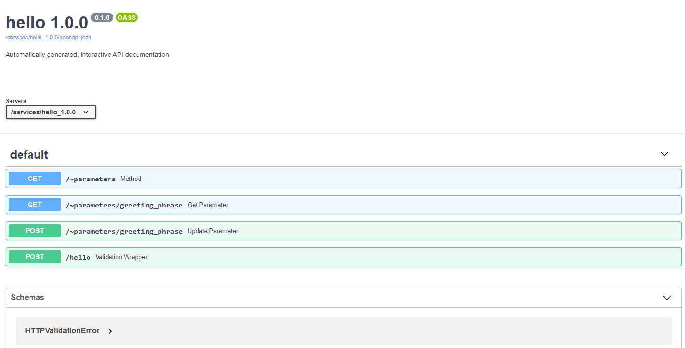

.. _autodocs-reference:

API Autodocs
============

Daeploy automatically creates interactive documentation for every service created using
the :ref:`sdk-reference`. It can be found at
http://your-host/services/servicename_version/docs.

Assume we have deployed the ``init`` service as `hello 1.0.0`, then the docs would
be reachable at http://your-host/services/hello_1.0.0/docs and look like:

(click image to enlarge)

Interacting with the Docs
-------------------------

Each endpoint function in the documentation can be clicked to get more information
about the data it expects and an example of a successful response and more. Let's try
the ``hello/`` function. Try it once with your name and once with "World". With your
name it should return "Hello <name>" and for "World" you should get "Greeting failed".

We expect to have gotten a notification, because in the code we wanted to raise a
notification if a user tried to greet the world, because of time constraints.
So head over to http://your-host/dashboard/ and click the notifications tab.
And we will see the notification there.
