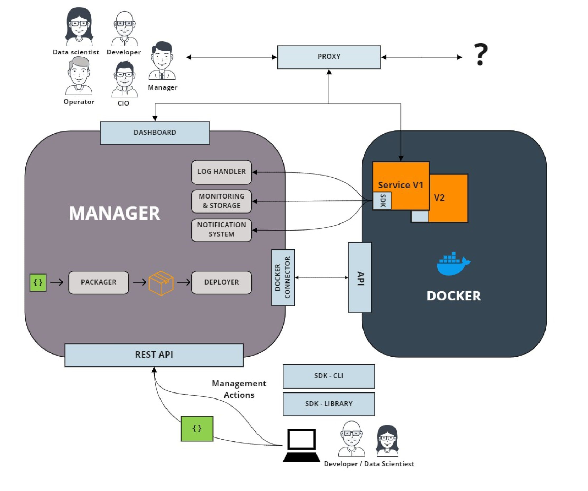

.. _daeploy-description-reference:

Daeploy
=======

The goal of Daeploy is to make deployment of
software, primarily focused around Machine Learning algorithms, quick and easy for anyone
who can code a bit in python. Daeploy consists of three components. The Manager, the Software
Development Kit (SDK) and the Command-Line Interface (CLI).

The Manager
-----------

The Daeploy Manager is a program that is installed in the runtime environment of your applications.
It could be a server in a factory, a virtual machine in the cloud or locally on your own computer.
The manager packages your code into services (loosely coupled pieces of software) which can be
communicated with using a HTTP-based
`REST <https://en.wikipedia.org/wiki/Representational_state_transfer>`_ API.
A Manager HAS to be up and running to be able to deploy sevices using Daeploy.

The Software Development Kit
----------------------------

The SDK is used when writing the code that should run in the services. It is installed
as a python package in the development environment. Daeploy strives to make the process of
creating these services as simple as possible, so the developer can focus more on the
solution and less on the deployment architecture. This is achieved by having an
easy-to-learn and unintrusive syntax.

The Command-Line interface
--------------------------

The CLI is used as the connection between the developer and the manager. It is used
to deploy (upload) the services you've written from your development environment to
the deployment environment, monitor the health and status of your services,
jumpstart new projects and more!

Architecture overview
---------------------

The image below shows the architecture of Daeploy and how all different parts interact with each other.

(click image to enlarge)