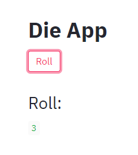

.. _streamlit-service-reference:

Using Streamlit to build a dashboard
====================================

In this tutorial we will see how to create a service with a graphical interface
using a very convenient python package called `streamlit <https://www.streamlit.io/>`_.

With streamlit it is very quick to make graphical applications and this can be
used together with Daeploy to make dashboards for monitoring or configuration of
your algorithms, just to name a few examples. We will not go into detail into how
to use streamlit itself, but rather how to deploy a streamlit application in Daeploy and
have it communicate with your services.

Creating the Streamlit Service
------------------------------

Let's reuse the `Die Roller` service we created as part of the `Yatzee` game in
:ref:`cross-service-reference` and create a roll button and a display for the
die roll. We start by creating a new project:

>>> daeploy init # doctest: +SKIP
project_name [my_project]: die_app

The first thing we have to do is to add ``streamlit`` to the `requirements.txt`
file:

.. literalinclude:: ../../../../examples/streamlit_service/requirements.txt

We rename `service.py` to `die_app.py` and write our streamlit app in that file: 

.. literalinclude:: ../../../../examples/streamlit_service/die_app.py

Notice how it does not end with ``service.run()`` like regular Daeploy services and
therefore nothing would happen if we were to deploy the service now. To run
streamlit apps we need to use the shell command ``streamlit run app.py``,
so for `die_app.py` to run when we deploy the service, we have to create a new
file called `app.sh` that runs the shell command:

.. literalinclude:: ../../../../examples/streamlit_service/app.sh

When a Daeploy service is deployed it will look for the environment variable ``APP_SCRIPT``
to decide which file should be run on start-up. It is `service.py` by default but it
can be changed by modifying the value of ``APP_SCRIPT`` in `.s2i/environment`:

.. literalinclude:: ../../../../examples/streamlit_service/.s2i/environment

.. note:: ``APP_SCRIPT`` is different from ``APP_FILE``. By using ``APP_SCRIPT`` we let
    s2i know to run that file as a script, rather than a python file. ``APP_SCRIPT`` can
    be any file that is executable in linux.

Deploying the Service
---------------------

Since `die_app` is dependent of `die_roller_service` it has to be up and running
before `die_app` can be used. The code for `die_roller_service` is:

.. literalinclude:: ../../../../examples/cross_service_communication/die_roller_service/service.py

>>> daeploy deploy die_roller 1.0.0 ./die_roller_service # doctest: +SKIP
Active host: http://your-host
Deploying service...
Service deployed successfully
MAIN    NAME         VERSION    STATUS    RUNNING
------  -----------  ---------  --------  -----------------------------------
*       die_roller   1.0.0      running   Running (since 2020-12-15 12:10:25)

We can now deploy the streamlit app, like we would any other, with one important
difference. Streamlit uses internal port 8501 to communicate so we have to explicitly
set the port when deploying:

>>> daeploy deploy die_app 1.0.0 ./die_app --port 8501 # doctest: +SKIP
Active host: http://your-host
Deploying service...
Service deployed successfully
MAIN    NAME     VERSION    STATUS    RUNNING
------  -------  ---------  --------  -----------------------------------
*       die_app  1.0.0      running   Running (since 2020-12-15 12:15:35)

.. note:: Daeploy services created using the SDK use port 8000, which is the default
    port for ``daeploy deploy``. But when deploying other apps it might be necessary
    to change it to not get a `Bad Gateway`.

Open http://your-host/services/die_app/ and you should see your app there:

